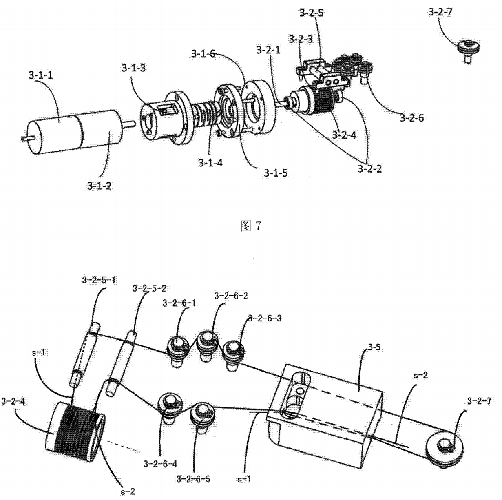

=======
Patents
=======

The academic name of walrus is *assignment expression*. In computer science, an expression is a syntactic entity in a programming language that may be evaluated to determine its value. So the expression could be treated as a value. ``x := foo()`` has two effects:

